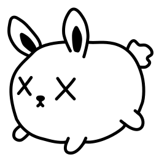

  
   
  <strong align="center">bunnie</strong>
  

bunnie lets u use Bun as the templating language in ur Rust applications.

The bunnie server runs separately from the Rust application.
the Rust application communicates with it via a unix socket.
bunnie takes requests for rendering a jsx component and serves rendered HTML.
bunnie components are `.jsx` files similar to React components.
bunnie components can be both full HTML pages or partials (for use with HTMX).

## Usage

See [bunnie-example](https://github.com/aspizu/bunnie-example) for a full Rust applicaation built using bunnie.
